# CrossScaleGeometry

CrossScaleGeometry is a modular research pipeline for studying how local geometry and row-associated attributes change across representation scales. The current paper application analyzes lexical structure in LLM unembedding matrices, but the pipeline can also be adapted to other matrices whose rows are independently meaningful vectors with associated token, string, categorical, or linguistic attributes.

This repository accompanies the paper **From Local Density to Lexical Features: A Cross-Scale Study of Unembedding Spaces**. It contains the analysis code, experiment notebooks, validation tests, compact result artifacts, and two repository-only extensions.

[Paper PDF](docs/paper/from-local-density-to-lexical-features.pdf) · [Compact results](res/) · [License](LICENSE)

## 1. What This Repository Supports

### Paper question

The paper asks how surface-level lexical properties of local token neighborhoods change as the same unembedding matrix is observed through PCA subspaces of increasing dimension.

### Observational scope

The unit of analysis is one row of an output-projection matrix. At each selected dimension, the rows are projected, L2-normalized, partitioned with HDBSCAN, and related to tokenizer-derived attributes. The study observes local geometry at several representation scales; it does not train a predictor or intervene on the model.

The packaged interfaces separate representation construction, clustering, metrics, controls, statistics, and plotting. New row-level attributes and geometric analysis methods can therefore be added without rewriting the complete workflow.

### Models

The paper studies the untied output projections of three models:

- `mistralai/Mistral-7B-v0.1`
- `mistralai/Mixtral-8x7B-v0.1`
- `openai/gpt-oss-20b`, stored locally as `gpt-oss`

### Primary measurements

- **Orthographic Similarity (O-S):** mean pairwise string similarity within each non-noise cluster.
- **Multi-Script Entropy (MS-E):** entropy of the token-level Unicode script distribution within each non-noise cluster.

### What the pipeline does not do

This is an offline, observational analysis. It does **not** modify model weights, prompts, logits, decoding, generation, or any other part of LLM inference. The export utility reads selected model artifacts; the experiment pipeline operates on the exported matrix and tokenizer.

Model weights, exported tensors, cluster partitions, and other large generated artifacts are intentionally excluded from version control.

## 2. Analysis Pipeline

<p align="center">
  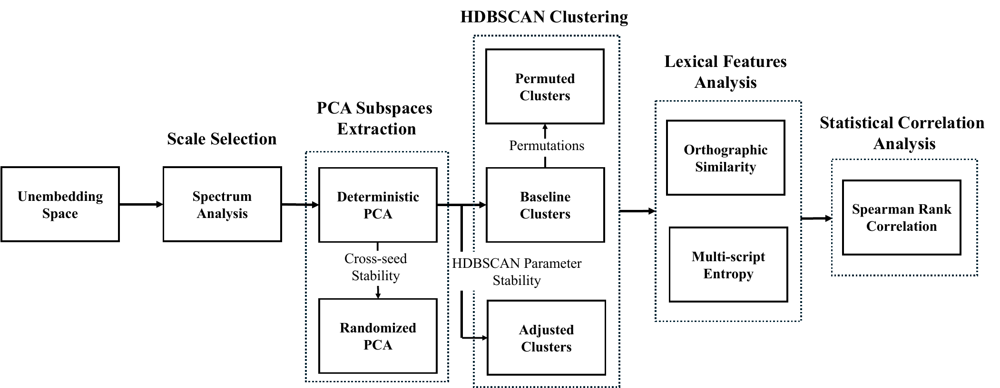
</p>

### Six stages

1. **Export:** save the output-projection matrix, tokenizer, and configuration for each model.
2. **Select scales:** analyze the singular-value spectrum and combine energy thresholds, spectrum elbows, and the full dimension.
3. **Build representations and partitions:** take nested prefixes of a shared full-PCA representation, L2-normalize rows, and run HDBSCAN.
4. **Measure clusters:** compute O-S and MS-E for every valid non-noise cluster.
5. **Aggregate across scales:** give each cluster equal weight when constructing scale-level means and standard deviations.
6. **Diagnose and test:** run randomized-PCA stability, HDBSCAN perturbations, permutation controls, random orthogonal projections, statistics, and reproducible plots.

### Main mathematical definitions

Let the analyzed matrix be $`W \in \mathbb{R}^{N \times d}`$, with one meaningful item per row. If $`\mu`$ is the row mean and $`V`$ contains the right principal directions of the centered matrix, the representation at scale $`k`$ is

```math
Z_k = (W - \mathbf{1}\mu^\top)V_{1:k},
\qquad
\widehat{z}_{i,k} = \frac{z_{i,k}}{\lVert z_{i,k}\rVert_2}.
```

All candidate scales use prefixes of the same ordered PCA basis. HDBSCAN is applied to the normalized rows $`\widehat{Z}_k`$ with Euclidean distance. The paper-scale set is

$$\mathcal{D} = \{d\} \cup \mathcal{D}_{\mathrm{energy}} \cup \mathcal{D}_{\mathrm{elbow}}.$$

For a non-noise cluster $`c`$ containing $`n_c`$ token strings, O-S is

$$\mathrm{O\text{-}S}(c) = \frac{2}{n_c(n_c-1)} \sum_{1 \le i < j \le n_c} S(x_i,x_j), \qquad S(x_i,x_j)=1-\mathrm{N\text{-}DIST}(x_i,x_j).$$

The implementation uses the positional-trigram N-DIST dynamic program with case-insensitive comparison through `str.casefold()`. It retains punctuation and tokenizer-specific markers. The active scoring path does not insert an artificial fixed prefix. Clusters of at most 512 tokens use all unordered pairs; larger clusters use ten deterministic subsamples of 128 tokens with seed `1813382118`.

For MS-E, each token receives one dominant Unicode script label. Unicode `Common`, `Inherited`, and unknown characters map to `Other`; unresolved ties map to `Mixed`. If $`p_s(c)`$ is the fraction of tokens in cluster $`c`$ assigned to script $`s`$, then

```math
H(c)=-\sum_{s \in \mathcal{S}}p_s(c)\log p_s(c),
\qquad
H_{\mathrm{norm}}(c)=\frac{H(c)}{\log |\mathcal{S}|}.
```

The pipeline persists both raw and normalized MS-E. The README figures use raw MS-E; within one model, normalization is a constant rescaling and therefore does not change rank correlations across scales.

Finally, if a scale has $`K`$ valid clusters and $`m(c)`$ is either cluster metric, the reported curve is

```math
\overline{m}
=
\frac{1}{K}\sum_{c=1}^{K}m(c),
\qquad
\sigma_m
=
\sqrt{
\frac{1}{K}
\sum_{c=1}^{K}
\left(m(c)-\overline{m}\right)^2
}.
```

HDBSCAN noise points, labeled `-1`, are excluded from lexical metrics. Clusters, rather than tokens, receive equal weight in the scale-level summaries.

## 3. Main Paper Results

### Nine model-specific scales

The union of the full dimension, cumulative spectral-energy thresholds at 50%, 75%, 90%, and 95%, and the top four log-spectrum elbows produces nine scales per model.

| Model | Selected PCA dimensions |
|---|---|
| Mistral-7B | 5, 142, 997, 2084, 3031, 3459, 3938, 4088, 4096 |
| Mixtral-8x7B | 8, 158, 1111, 2156, 3052, 3457, 3957, 4093, 4096 |
| GPT-oss-20B | 6, 182, 466, 739, 1591, 2264, 2532, 2868, 2880 |

Scale index therefore means the ascending position within a model-specific list, not a shared PCA dimension across models.

### Baseline curves

<p align="center">
  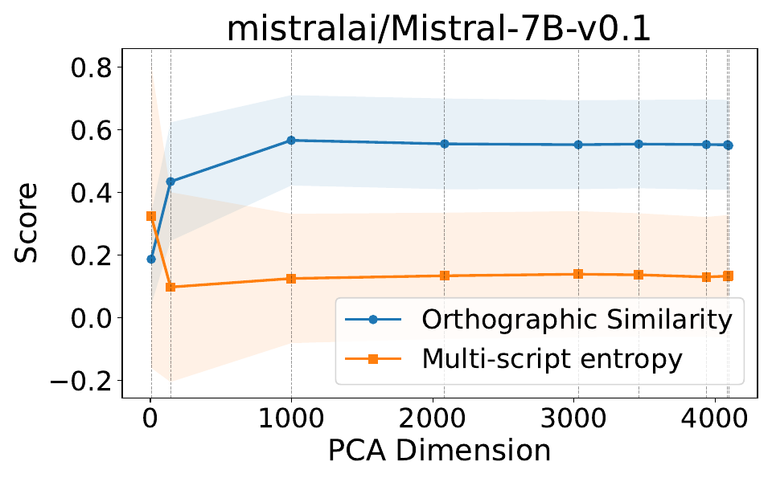
  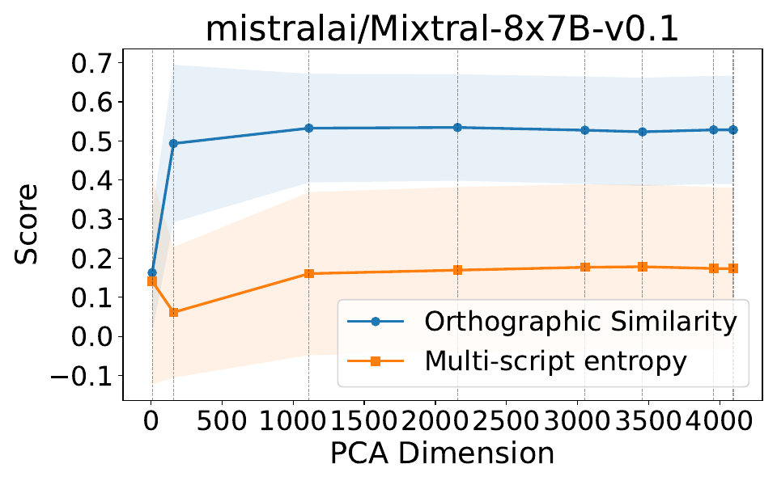
  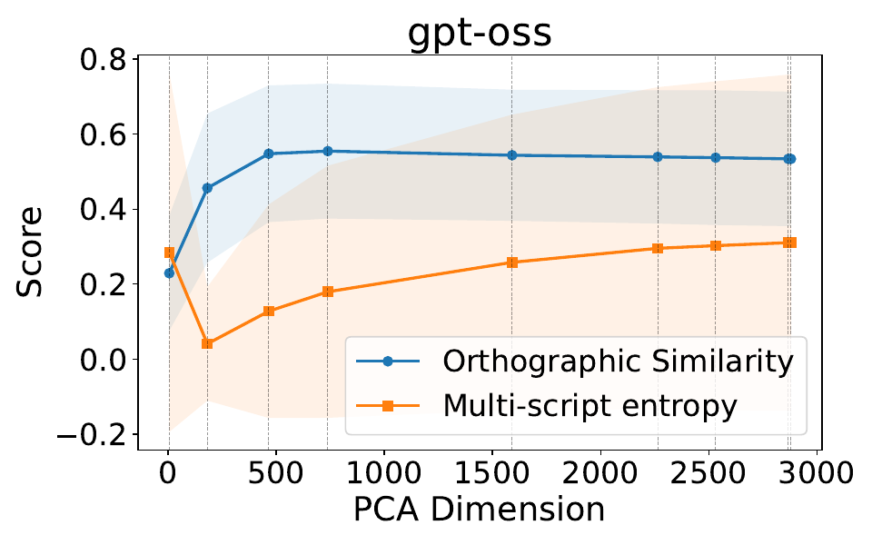
</p>

Across all three models, the lowest-dimensional observations have lower O-S and generally higher MS-E than the later scales. O-S rises sharply before flattening or decreasing slightly. MS-E first falls and later rises. The shared qualitative pattern is the paper's central observation; the exact turning points and cluster partitions remain model-specific.

The lines show equal-cluster means and the shaded regions show cluster-level population standard deviations. High-resolution PDFs and selected control curves are available in [`res/linguistic/`](res/linguistic/).

## 4. Robustness and Diagnostic Results

### 4.1 Cluster counts, sizes, and noise fractions

<p align="center">
  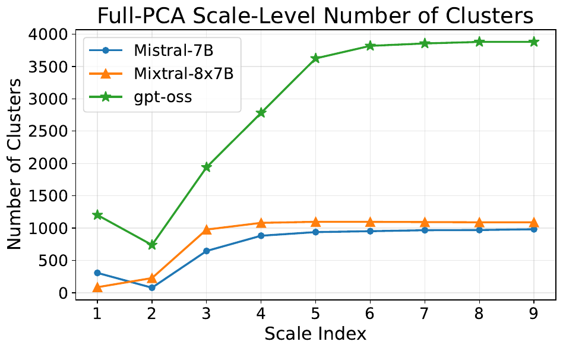
  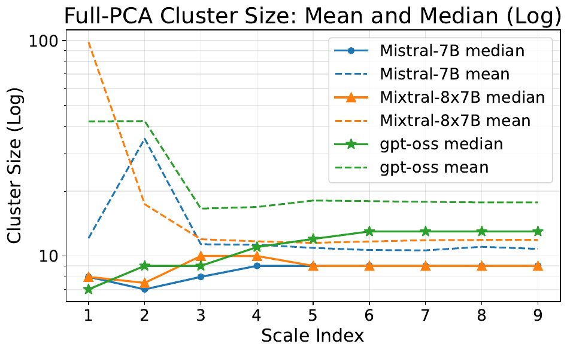
</p>

The first two scales are structurally unstable: cluster counts, sizes, and noise assignments change sharply. From the middle scales onward, cluster sizes stabilize while the number of identified clusters generally continues to increase.

| Model | SI=1 | SI=2 | SI=3 | SI=4 | SI=5 | SI=6 | SI=7 | SI=8 | SI=9 |
|---|---:|---:|---:|---:|---:|---:|---:|---:|---:|
| Mistral-7B | 88.4% | 91.3% | 77.1% | 68.9% | 68.0% | 68.3% | 67.9% | 66.5% | 66.9% |
| Mixtral-8x7B | 73.2% | 87.6% | 63.5% | 60.5% | 60.0% | 60.0% | 59.5% | 59.5% | 59.5% |
| GPT-oss-20B | 74.8% | 84.4% | 84.0% | 76.6% | 67.4% | 65.9% | 65.8% | 65.8% | 65.8% |

The table reports the fraction of matrix rows labeled as HDBSCAN noise. `SI` is the model-specific ascending scale index.

### 4.2 Randomized-PCA stability

Randomized PCA approximates data-aligned principal directions with a stochastic solver. This control tests numerical and seed stability, not the effect of replacing PCA with unrelated directions. The table reports Spearman correlation between each randomized-PCA curve and the deterministic full-PCA curve, summarized across eight seeds.

| Model | O-S rho | O-S p-value | MS-E rho | MS-E p-value |
|---|---:|---:|---:|---:|
| Mistral-7B | 0.965 ± 0.033 | 0.000 ± 0.000 | 0.960 ± 0.031 | 0.000 ± 0.000 |
| Mixtral-8x7B | 0.956 ± 0.053 | 0.001 ± 0.001 | 0.929 ± 0.053 | 0.001 ± 0.001 |
| GPT-oss-20B | 0.996 ± 0.008 | 0.000 ± 0.000 | 0.985 ± 0.011 | 0.001 ± 0.002 |

The high correlations show that the cross-scale curves are not artifacts of one randomized solver seed. They do not imply that individual cluster identities are identical across seeds.

<details>
<summary>Representative randomized-PCA curves</summary>

<p align="center">
  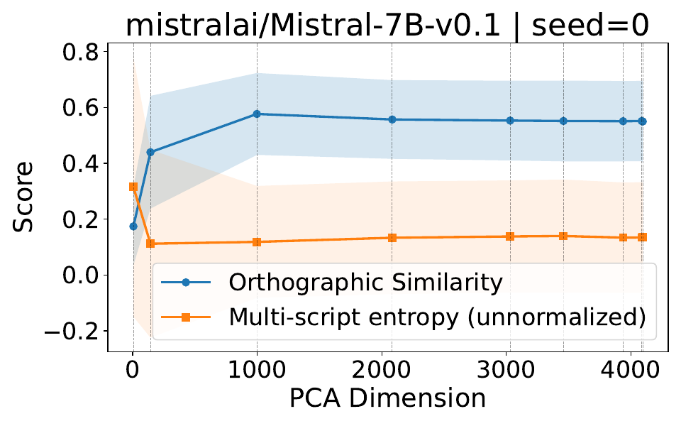
  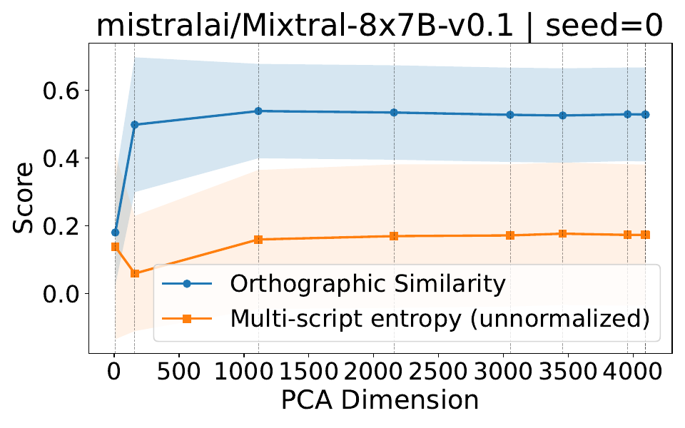
  
</p>

<p align="center">
  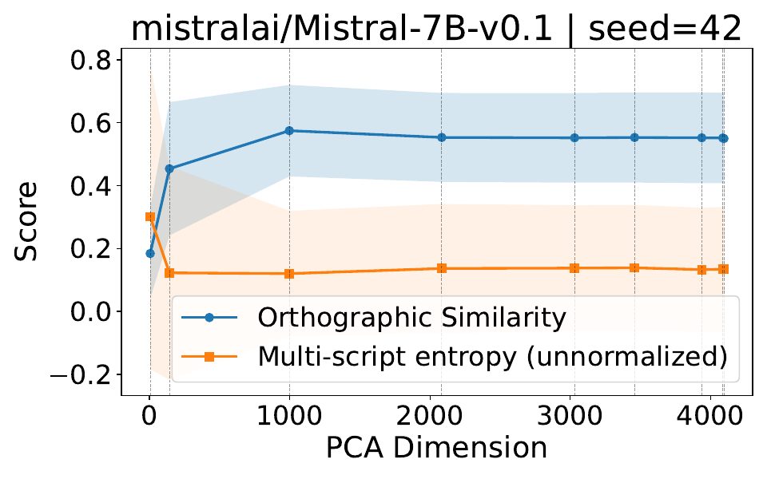
  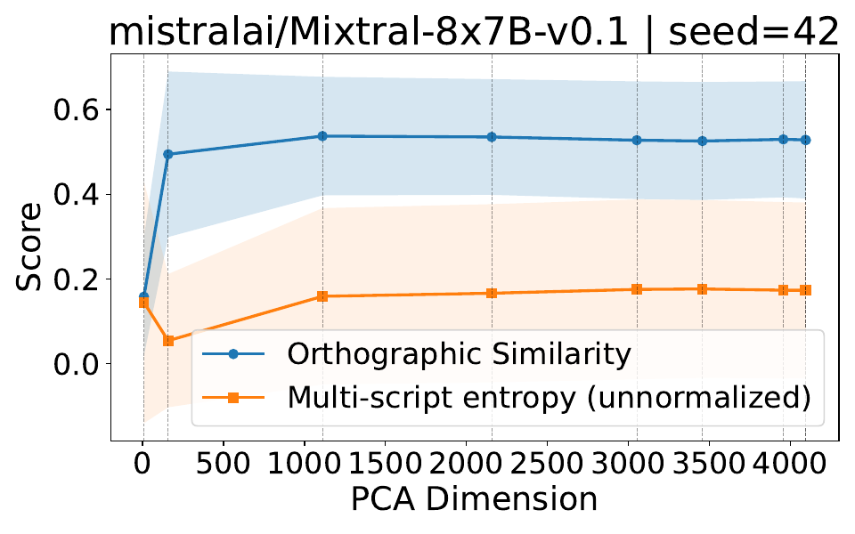
  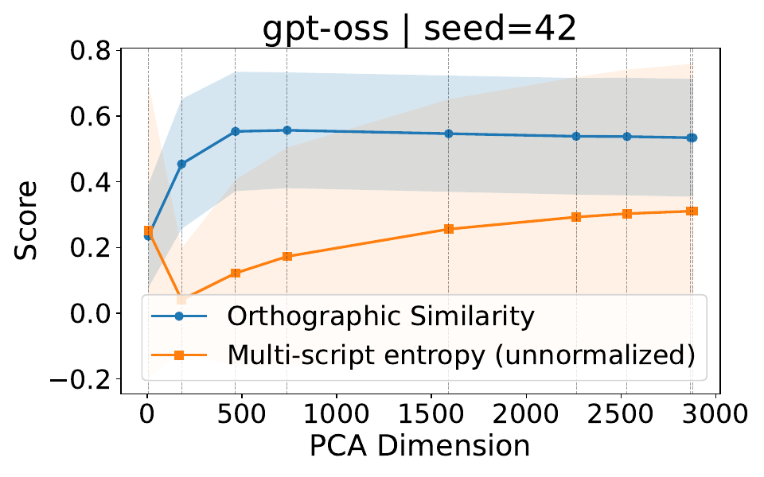
</p>

</details>

### 4.3 HDBSCAN parameter stability

The baseline uses `min_cluster_size=5` and `min_samples=5`. Six nearby configurations are evaluated: `(6, 5)`, `(5, 6)`, `(6, 6)`, `(4, 5)`, `(5, 4)`, and `(4, 4)`.

| Model | O-S MAE | MS-E MAE | Joint MAE | O-S R2 | MS-E R2 | Joint R2 |
|---|---:|---:|---:|---:|---:|---:|
| Mistral-7B | 0.0126 | 0.0110 | 0.0118 | 0.9845 | 0.9151 | 0.9931 |
| Mixtral-8x7B | 0.0130 | 0.0102 | 0.0116 | 0.9813 | 0.8781 | 0.9942 |
| GPT-oss-20B | 0.0165 | 0.0223 | 0.0194 | 0.9655 | 0.9235 | 0.9815 |

Mean joint Spearman correlations are 0.9542 for Mistral-7B, 0.5710 for Mixtral-8x7B, and 0.8000 for GPT-oss-20B. These are local perturbations around a fixed observation resolution, not a search for an optimal HDBSCAN configuration.

### 4.4 Token permutation

The global permutation control preserves every partition, cluster size, and non-noise position, but randomly reassigns token IDs before recomputing lexical metrics. Ten fixed seeds are averaged.

| Model | O-S rho | O-S p-value | MS-E rho | MS-E p-value |
|---|---:|---:|---:|---:|
| Mistral-7B | 0.333 | 0.381 | -0.217 | 0.576 |
| Mixtral-8x7B | -0.233 | 0.546 | -0.283 | 0.460 |
| GPT-oss-20B | -0.450 | 0.224 | -0.900 | 0.001 |

The control generally breaks the baseline ordering and level. GPT-oss MS-E retains a strong negative rank correlation, so the result should be read as disruption and reversal rather than as universal absence of correlation. With only nine scale points, rank correlation is interpreted together with absolute error and R2.

<p align="center">
  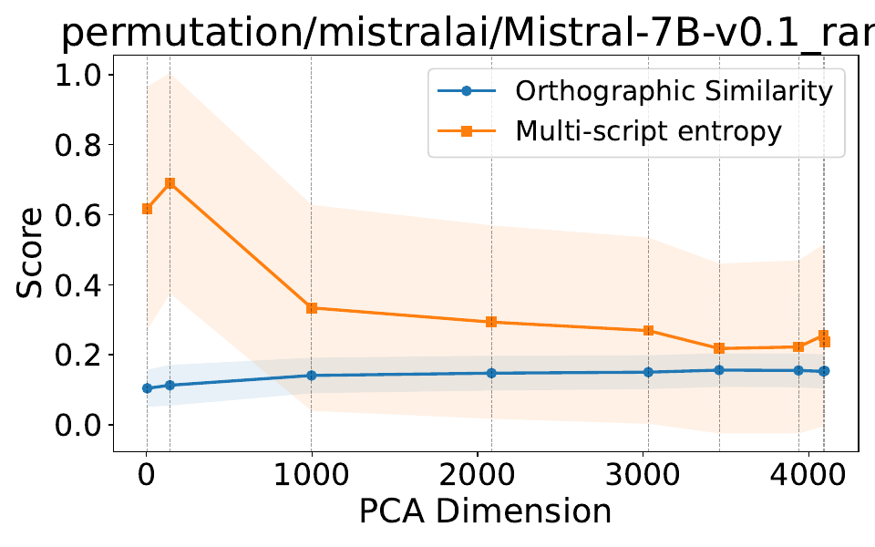
  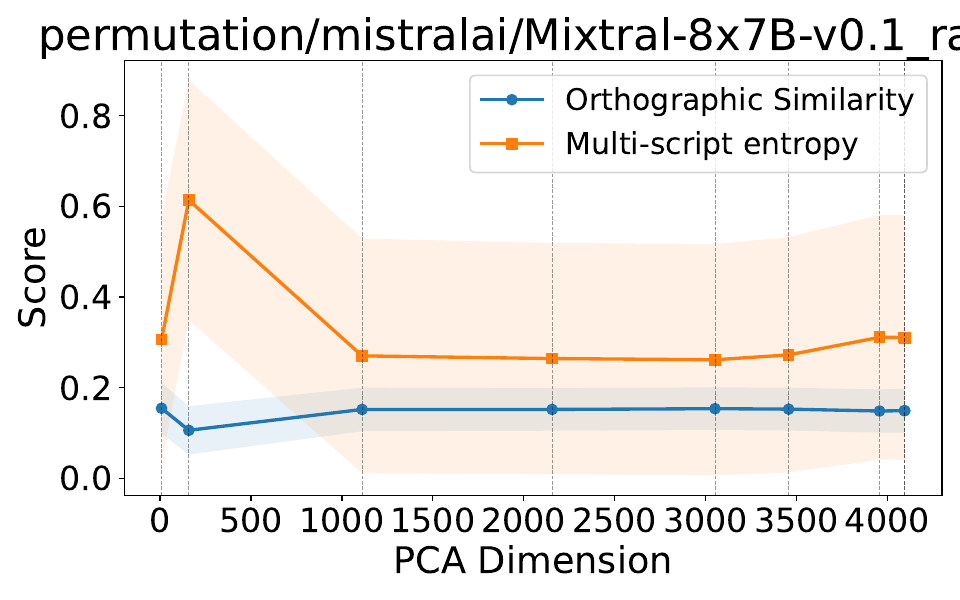
  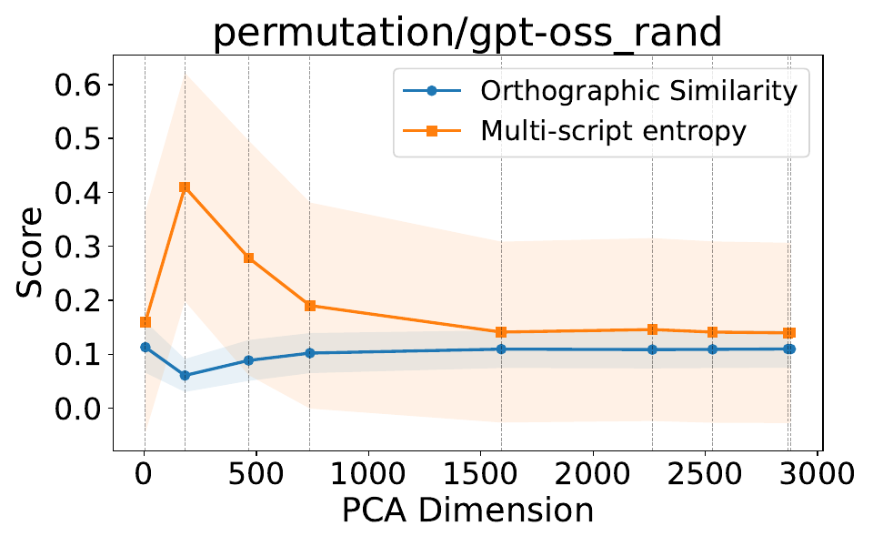
</p>

### 4.5 Length-bucket permutation

The stricter O-S control permits token exchange only within character-length buckets `1-2`, `3-5`, `6-10`, and `11+`. It preserves the valid token set, cluster sizes, and coarse token-length composition while disrupting token-cluster assignment.

| Model | Spearman p-value | MAE | R2 |
|---|---:|---:|---:|
| Mistral-7B | 0.1491 | 0.3514 | -8.7701 |
| Mixtral-8x7B | 0.0610 | 0.3345 | -8.4158 |
| GPT-oss-20B | 0.3260 | 0.3896 | -15.6177 |

All three controls lose conventional rank-correlation significance. Their strongly negative R2 values mean that a constant baseline-mean predictor explains the deterministic curve better than the permuted curve. This control is applied only to O-S because token length is a direct orthographic confound.

## 5. Additional Analyses

These experiments extend the paper-scale analysis but are not primary claims of the paper.

### 5.1 Dense low-dimensional sampling (Low12)

#### Motivation

The main experiment samples only a few points in the lowest-dimensional region. Low12 asks whether the early lexical change looks like a gradual trend, a sharp step, or a model-specific mixture of both.

#### Experimental design

Low12 uses twelve cumulative spectral-energy thresholds:

```math
\{12\%,15\%,18\%,21\%,24\%,27\%,30\%,33\%,36\%,39\%,42\%,45\%\}.
```

These thresholds produce twelve model-specific candidate scales:

| Model | Selected PCA dimensions |
|---|---|
| Mistral-7B | 6, 44, 95, 155, 223, 296, 373, 455, 541, 631, 725, 824 |
| Mixtral-8x7B | 76, 134, 198, 267, 339, 415, 494, 577, 663, 752, 845, 942 |
| GPT-oss-20B | 37, 60, 88, 122, 162, 209, 262, 320, 384, 452, 525, 602 |

As in the main experiment, Low12 scale index means the ascending position within a model-specific list, not a shared PCA dimension across models or experiments.

The experiment reuses the fixed spectrum and deterministic full-PCA basis. It creates 36 baseline partitions and repeats the randomized-PCA, six-configuration HDBSCAN, ten-seed global-permutation, and ten-seed length-bucket controls over the denser domain. Full reproduction therefore involves hundreds of clustering and metric tasks.

#### Results

<p align="center">
  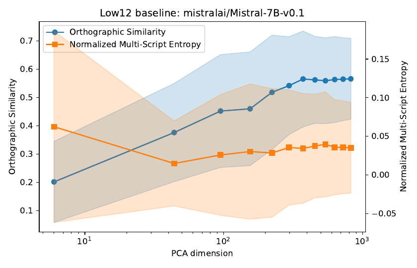
  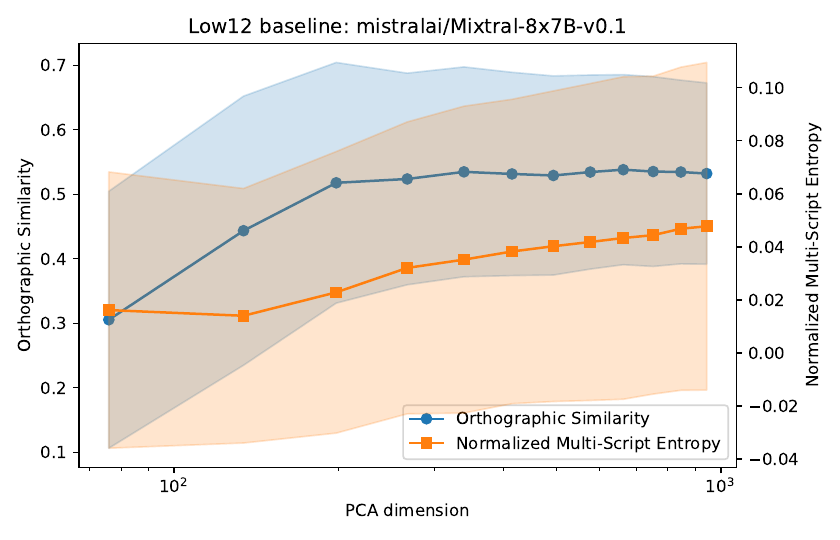
  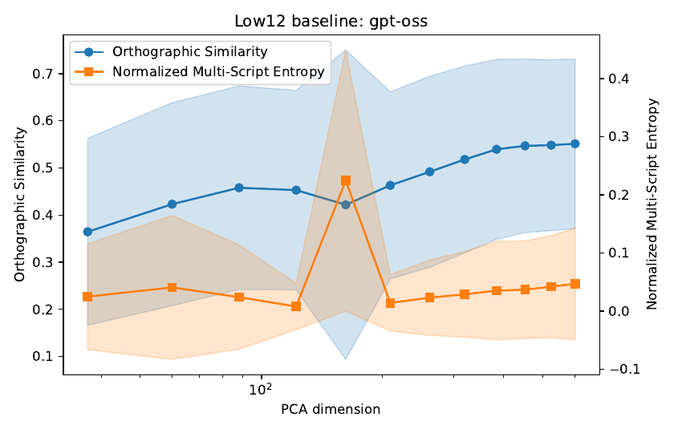
</p>

O-S increases across the low-dimensional range in all three models, but at different rates. Mistral rises from 0.201 at dimension 6 to approximately 0.56 from dimension 373 onward. Mixtral rises from 0.306 at dimension 76 to 0.518 at dimension 198, then remains near 0.53. GPT-oss rises from 0.365 at dimension 37 to 0.551 at dimension 602, with local non-monotonicity in the middle. Raw MS-E is more variable at the earliest scales and does not define one common transition location.

#### Cluster counts, sizes, and noise fractions

<p align="center">
  <a href="assets/low12_cluster_counts.pdf">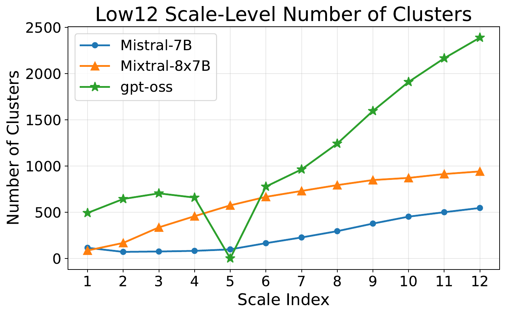</a>
  <a href="assets/low12_cluster_sizes.pdf">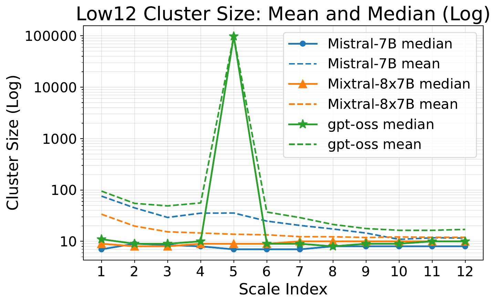</a>
  <a href="assets/low12_noise_fraction.pdf">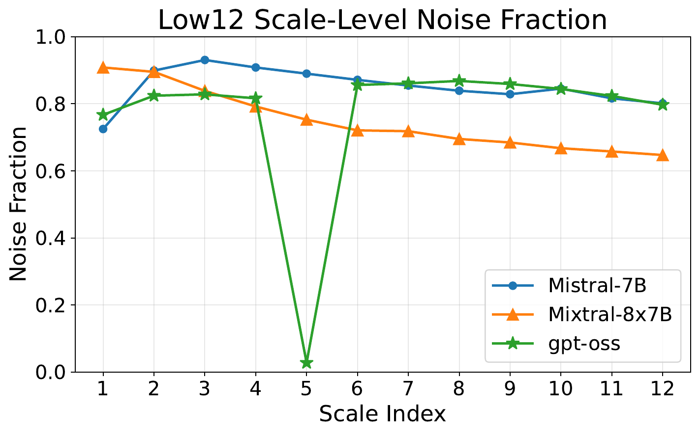</a>
</p>
Across the twelve low-dimensional observations, cluster counts generally increase while mean non-noise cluster sizes generally decrease. Median cluster sizes remain comparatively small and stable for most models and scales. Noise fractions are model-specific: Mixtral decreases fairly steadily, Mistral rises at the earliest scales and then broadly declines, and GPT-oss remains high except for one discontinuous partition at SI=5.

At GPT-oss SI=5, corresponding to PCA dimension 162, HDBSCAN returns only two non-noise clusters and labels 2.8% of rows as noise. The resulting mean and median cluster sizes are both 97,774 tokens. Because the adjacent scales return hundreds of clusters and noise fractions above 80%, this isolated point should be interpreted as a partition discontinuity rather than a smooth dimensional transition.

<details>
<summary>Low12 noise fractions by scale index</summary>

| Model | SI=1 | SI=2 | SI=3 | SI=4 | SI=5 | SI=6 | SI=7 | SI=8 | SI=9 | SI=10 | SI=11 | SI=12 |
|---|---:|---:|---:|---:|---:|---:|---:|---:|---:|---:|---:|---:|
| Mistral-7B | 72.5% | 89.9% | 93.1% | 90.8% | 89.0% | 87.1% | 85.4% | 83.9% | 82.9% | 84.5% | 81.6% | 80.1% |
| Mixtral-8x7B | 90.8% | 89.5% | 83.8% | 79.2% | 75.3% | 72.1% | 71.8% | 69.5% | 68.5% | 66.7% | 65.8% | 64.7% |
| GPT-oss-20B | 76.7% | 82.4% | 82.8% | 81.6% | 2.8% | 85.6% | 86.1% | 86.8% | 85.9% | 84.4% | 82.3% | 79.7% |

The table reports the fraction of matrix rows labeled as HDBSCAN noise. `SI` is the ascending position within each model's Low12 candidate-scale list.

</details>

The complete persistent workflow is in [`1r_low_dimension_spectrum_anlys.ipynb`](1r_low_dimension_spectrum_anlys.ipynb). Reproduction writes the underlying plotting tables beneath `comp_supplement/low_energy_lt050_v1/figures/baseline/`; this generated artifact tree is excluded from version control.

#### What this says about trend vs step

Low12 supports a steep early trend followed by saturation more clearly than a universal step function. The increase is distributed over multiple adjacent energy thresholds, its location differs by model, and local reversals remain visible. These observations do not exclude model-specific transition regions, but they do not identify one shared critical dimension or energy threshold.

### 5.2 Random orthogonal projection

#### Question being tested

Randomized PCA still follows data-aligned principal directions. Random orthogonal projection instead asks whether dimensionality alone can reproduce the baseline curves when PCA alignment is removed.

#### Design

For each model and each of ten fixed seeds, the experiment constructs one full random orthogonal basis and takes nested prefixes at the nine main-study dimensions. Rows are L2-normalized and clustered with the same HDBSCAN configuration as the baseline. Using one basis per seed preserves nesting across scales.

#### Results

<p align="center">
  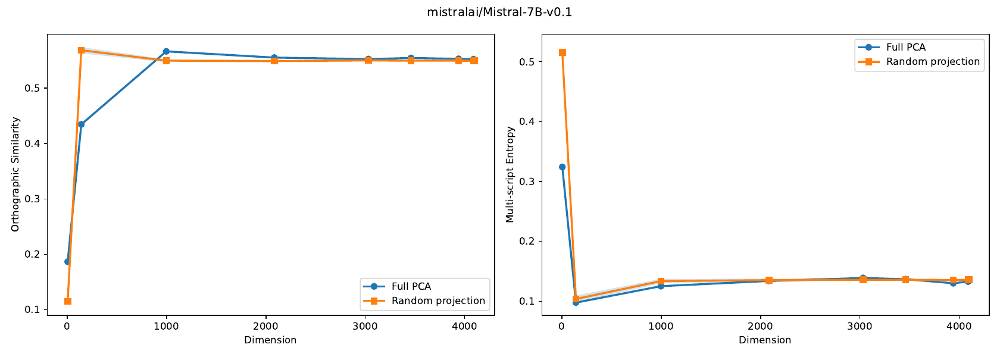
</p>

<p align="center">
  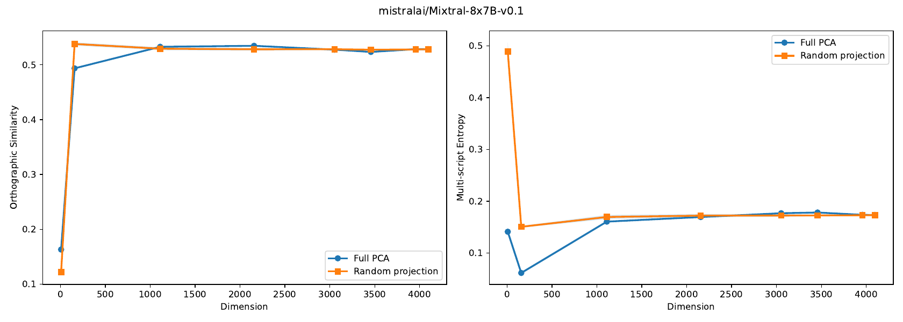
</p>

<p align="center">
  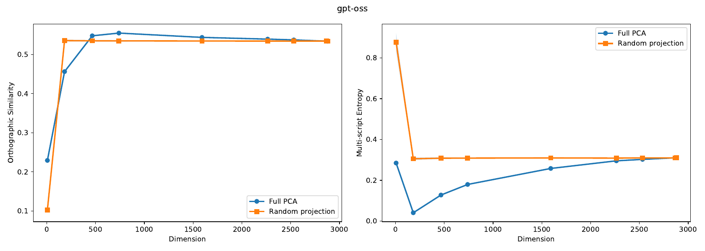
</p>

The largest PCA-versus-random differences occur at reduced dimensions. The random projections do not consistently recover the PCA ordering of O-S; MS-E agrees more strongly for Mistral and GPT-oss than for Mixtral. All controls converge to near-equivalent partitions at full dimension.

#### PCA vs RP quantitative summary

The table compares the deterministic PCA curve with the mean curve across ten random-projection seeds.

| Model | O-S rho | O-S p-value | MS-E rho | MS-E p-value | Joint rho | Joint p-value |
|---|---:|---:|---:|---:|---:|---:|
| Mistral-7B | 0.167 | 0.668 | 0.850 | 0.004 | 0.719 | 0.001 |
| Mixtral-8x7B | 0.233 | 0.546 | 0.217 | 0.576 | 0.459 | 0.055 |
| GPT-oss-20B | 0.467 | 0.205 | 0.700 | 0.036 | 0.455 | 0.058 |

The joint comparison concatenates baseline-standardized O-S and MS-E values. It is a compact two-metric diagnostic, not an additional lexical measurement.

#### Full-dimensional invariance explanation

At $`k=d`$, an exact orthogonal transform $`Q`$ preserves Euclidean geometry:

```math
\lVert (x_i-x_j)Q \rVert_2
=
\lVert x_i-x_j \rVert_2.
```

The full-dimensional clustering should therefore be invariant in exact arithmetic. The observed GPU pipeline is nearly, but not exactly, invariant because finite-precision projection, normalization, neighbor search, and density-boundary decisions can change a small number of labels.

| Model | Mean ARI | ARI range | Mean AMI | AMI range |
|---|---:|---:|---:|---:|
| Mistral-7B | 0.977045 | 0.976712-0.977380 | 0.987710 | 0.987387-0.988062 |
| Mixtral-8x7B | 0.998748 | 0.997806-0.999268 | 0.998887 | 0.998275-0.999365 |
| GPT-oss-20B | 0.999634 | 0.999547-0.999707 | 0.999635 | 0.999517-0.999711 |

The control therefore verifies numerical near-invariance, not exact equality of every HDBSCAN label. Its implementation is in [`4r_random_projection_hdbscan.ipynb`](4r_random_projection_hdbscan.ipynb) and [`cluster_anlys/random_projection.py`](cluster_anlys/random_projection.py).

## 6. Model and Vocabulary Configuration

### Matrix and vocabulary sizes

| Model | Output-projection shape | Configured vocabulary | Tokenizer entries available | Full dimension |
|---|---:|---:|---:|---:|
| Mistral-7B-v0.1 | 32,000 x 4,096 | 32,000 | 32,000 | 4,096 |
| Mixtral-8x7B-v0.1 | 32,000 x 4,096 | 32,000 | 32,000 | 4,096 |
| GPT-oss-20B | 201,088 x 2,880 | 199,998 | 200,019 | 2,880 |

The analyzed population is the set of output-projection rows, not the configured vocabulary size. GPT-oss has a padded output head: 1,069 matrix rows lie beyond the tokenizer entries available through `len(tokenizer)`.

### Special-token policy

No special-token filter is applied before PCA or clustering. Tokenizer-defined special tokens, reserved entries, and output-only padded rows remain part of the matrix-row population. GPT-oss row IDs beyond the tokenizer mapping decode to empty strings in the current lexical metric path and are classified as `Other` for script analysis. HDBSCAN noise is the only population removed before cluster-level lexical aggregation.

This policy keeps matrix geometry intact and makes row inclusion reproducible, but it should be considered when interpreting lexical summaries. The normalized MS-E denominator is derived from the model-level script set exposed by the tokenizer vocabulary.

### Preprocessing

- Full PCA centers the output-projection matrix; the spectrum-selection metadata records the uncentered matrix spectrum used to choose scales.
- Every scale is a nested prefix of one full-PCA basis.
- Projected rows are L2-normalized before Euclidean HDBSCAN.
- The baseline uses `min_cluster_size=5`, `min_samples=5`, and Euclidean distance.
- O-S case-folds decoded token strings and otherwise retains the decoded string, including punctuation and subword markers.
- MS-E assigns one dominant Unicode script to each token before forming cluster distributions.
- The modular metric tables persist token IDs and numerical aggregates, not decoded token strings.

## 7. Interpretation and Scope

### What the results support

- Local lexical organization changes systematically with representation scale in all three analyzed unembedding matrices.
- The aggregate baseline curves are stable to randomized-PCA seeds and nearby HDBSCAN configurations.
- Token-cluster assignment carries information beyond cluster size and coarse token length.
- PCA-aligned low-dimensional subspaces are not interchangeable with arbitrary orthogonal subspaces of the same dimension.
- Dense low-dimensional sampling favors an early trend with model-specific saturation over one universal step.

### What the results do not support

- They do not establish a causal effect on model behavior or inference.
- They do not show that O-S or MS-E measures semantics, concepts, or linguistic competence.
- They do not identify a universal critical dimension shared by the three models.
- They do not imply that individual cluster identities persist across scales, seeds, parameter settings, or projection families.
- They do not demonstrate that HDBSCAN is an optimal or unique description of the geometry.
- They do not automatically generalize from these three untied output projections to every model, layer, matrix, or tokenizer.

### Interpretability implication

The main interpretability lesson is methodological: a lexical pattern observed in a representation matrix depends on observation scale and, at reduced dimension, on the chosen directions. Aggregate cross-scale curves can be reproducible even when local partitions change. Interpretability claims should therefore state the matrix, projection rule, scale-selection rule, clustering resolution, token policy, and metric together.

The same discipline applies beyond token vocabularies. Any matrix with independently meaningful rows and row-associated attributes can use the pipeline to test how local geometry and attributes co-vary across scales, provided that the metric and null controls are appropriate for that domain.

## 8. Reproduction

### Repository map

| Path | Responsibility |
|---|---|
| [`cluster_anlys/spectrum_pipeline.py`](cluster_anlys/spectrum_pipeline.py) | Spectrum loading, scale selection, and diagnostics |
| [`cluster_anlys/representation_pipeline.py`](cluster_anlys/representation_pipeline.py) | PCA and random-projection representation stages |
| [`cluster_anlys/clustering_pipeline.py`](cluster_anlys/clustering_pipeline.py) | Scale tasks, HDBSCAN, and partition manifests |
| [`cluster_anlys/metric_pipeline.py`](cluster_anlys/metric_pipeline.py) | O-S, MS-E, result tables, and resumable metrics |
| [`cluster_anlys/permutation_pipeline.py`](cluster_anlys/permutation_pipeline.py) | Global and length-bucket permutation controls |
| [`cluster_anlys/statistics_pipeline.py`](cluster_anlys/statistics_pipeline.py) | Curve alignment, correlations, MAE, and R2 |
| [`cluster_anlys/plotting_pipeline.py`](cluster_anlys/plotting_pipeline.py) | Reproducible figures and sibling plotting tables |
| [`cluster_anlys/experiment_orchestrator.py`](cluster_anlys/experiment_orchestrator.py) | Multi-stage experiment orchestration |
| [`tests/`](tests/) | Unit and contract tests for the packaged pipeline |
| [`res/`](res/) | Compact paper-scale results and metadata |
| [`assets/`](assets/) | README preview figures |

The notebooks retain the historical experiment sequence:

| Stage | Notebook | Purpose |
|---:|---|---|
| 0 | [`00_init.ipynb`](00_init.ipynb) | Model, tokenizer, and tensor preparation |
| 1 | [`1_spectrum_anlys.ipynb`](1_spectrum_anlys.ipynb) | Main spectrum analysis and scale selection |
| 1R | [`1r_low_dimension_spectrum_anlys.ipynb`](1r_low_dimension_spectrum_anlys.ipynb) | End-to-end Low12 supplement |
| 2 | [`2_full_pca.ipynb`](2_full_pca.ipynb) | Deterministic full PCA |
| 3 | [`3_hdbscan_gpu.ipynb`](3_hdbscan_gpu.ipynb) | Baseline GPU HDBSCAN |
| 3R | [`3r_hdbscan_gpu.ipynb`](3r_hdbscan_gpu.ipynb) | HDBSCAN parameter stability |
| 4 | [`4_random PCA_hdbscan.ipynb`](4_random%20PCA_hdbscan.ipynb) | Randomized-PCA stability |
| 4R | [`4r_random_projection_hdbscan.ipynb`](4r_random_projection_hdbscan.ipynb) | Random orthogonal projection |
| 5 / 5R | [`5_morphology.ipynb`](5_morphology.ipynb), [`5r_morphology.ipynb`](5r_morphology.ipynb) | Orthographic analyses |
| 6 / 6R | [`6_multi-ligual.ipynb`](6_multi-ligual.ipynb), [`6r_multi-ligual.ipynb`](6r_multi-ligual.ipynb) | Multi-script analyses |
| 7 / 7R | [`7_spearman.ipynb`](7_spearman.ipynb), [`7r_pearson.ipynb`](7r_pearson.ipynb) | Cross-scale association statistics |
| 8 | [`8_permutation.ipynb`](8_permutation.ipynb) | Token permutation controls |
| 9 | [`9_case study.ipynb`](9_case%20study.ipynb) | Cluster-level case studies |
| 10 | [`10_statistic.ipynb`](10_statistic.ipynb), [`10p_statistic.ipynb`](10p_statistic.ipynb), [`10r_statistic.ipynb`](10r_statistic.ipynb) | Baseline, permutation, and stability summaries |

The `R` suffix is historical and has no single meaning. Use the notebook descriptions rather than inferring an experiment from its filename.

### Installation

Python 3.10 is the reference environment; package metadata supports Python 3.10 through 3.12.

```bash
python -m venv .venv
source .venv/bin/activate
python -m pip install --upgrade pip
python -m pip install -r requirements.txt
```

The complete GPU clustering workflow requires NVIDIA CUDA and RAPIDS cuML. The repository provides a CUDA 12 environment:

```bash
conda env create -f environment.yml
conda activate cross-scale-geometry
```

An existing CUDA 12 environment can instead use:

```bash
python -m pip install -r requirements-gpu.txt
```

Verify the packaged pipeline with:

```bash
python -m unittest discover -s tests -q
```

### Data preparation

No model weights or output-projection tensors are distributed here. Export the required Hugging Face artifacts with, for example:

```bash
python dump_hf_tensors.py \
  --model_name mistralai/Mistral-7B-v0.1 \
  --out_dir . \
  --spaces output_proj
```

Repeat the export for each model. Authentication and upstream license acceptance may be required. The notebooks expect:

| Model source | Expected local root |
|---|---|
| `mistralai/Mistral-7B-v0.1` | `mistralai/Mistral-7B-v0.1/` |
| `mistralai/Mixtral-8x7B-v0.1` | `mistralai/Mixtral-8x7B-v0.1/` |
| `openai/gpt-oss-20b` | `gpt-oss/` |

Each root must contain `tokenizer/` and `tensors/output_proj.pt`. See [`00_init.ipynb`](00_init.ipynb) and [`dump_hf_tensors.py`](dump_hf_tensors.py) for the complete export path.

### Running experiments

The main dependency order is:

1. `00_init.ipynb`
2. `1_spectrum_anlys.ipynb`
3. `2_full_pca.ipynb`
4. `3_hdbscan_gpu.ipynb`
5. `5_morphology.ipynb` and `6_multi-ligual.ipynb`
6. `7_spearman.ipynb` and the `10*_statistic.ipynb` summaries

Run the control branches after their baseline representations or partitions exist:

- `3r_hdbscan_gpu.ipynb` for HDBSCAN perturbations;
- `4_random PCA_hdbscan.ipynb` for randomized PCA;
- `4r_random_projection_hdbscan.ipynb` for random orthogonal projection;
- `8_permutation.ipynb` for permutation controls;
- `1r_low_dimension_spectrum_anlys.ipynb` for the isolated Low12 workflow.

Low12 is low-dimensional, not lightweight. Complete reproduction of all models and controls requires a GPU, long runtimes, and potentially hundreds of gigabytes of local storage.

### Persistence

- `res/spectrum_analysis/` stores compact spectrum arrays, selected scales, and provenance metadata.
- `res/linguistic/` stores paper-scale lexical plots and selected controls.
- `res/clusters/` stores compact baseline cluster diagnostics.
- `comp/` stores main-workflow generated matrices, partitions, metrics, and control artifacts.
- `comp_supplement/` stores the independent Low12 artifact tree.
- `assets/` stores PNG previews used by this README.

Large local artifact roots are ignored by Git. Pipeline stages write manifests, metadata, and explicit completion markers so that expensive tasks can be validated and resumed. Plotting stages write a sibling data table for every generated figure.

## 9. Citation / License

### Citation

Archival citation metadata will be added when it becomes available. Until then, cite the accompanying paper by title:

> From Local Density to Lexical Features: A Cross-Scale Study of Unembedding Spaces.

### License

Source code in this repository is licensed under the [Apache License 2.0](LICENSE). Model weights, tokenizers, and downloaded artifacts remain subject to their upstream licenses and are not redistributed by this repository.
